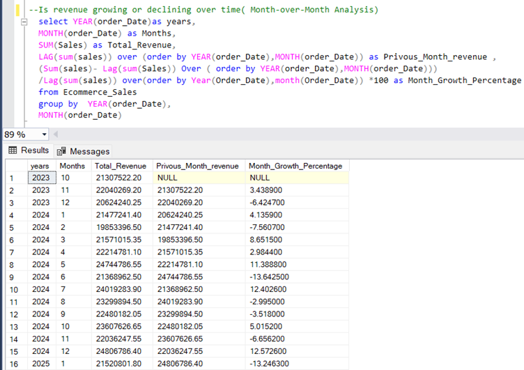
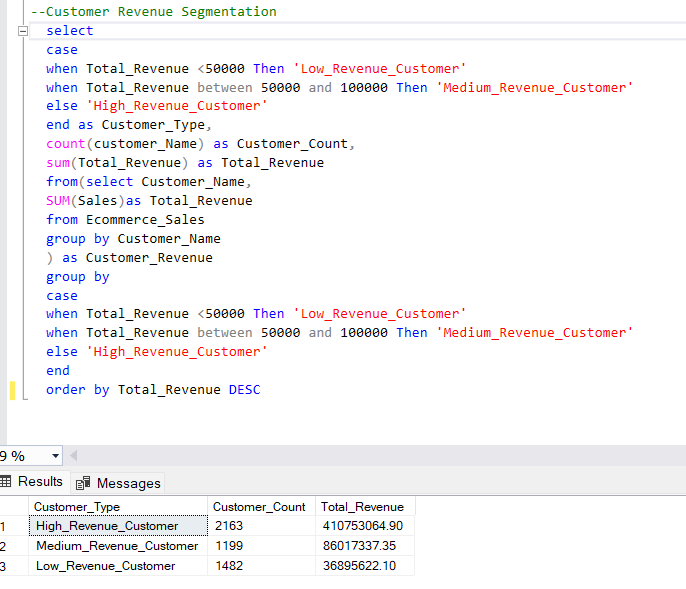

# 🧠 E-Commerce Sales Analysis using Advanced SQL

---

## 📌 Project Overview

This project demonstrates **advanced SQL analysis applied to an E-commerce sales dataset** to uncover meaningful business insights related to revenue performance, customer behavior, and product demand.

The objective of the analysis is to transform raw transactional data into **actionable business intelligence** through structured data validation, KPI analysis, segmentation, and advanced analytical SQL queries.

The project simulates the type of analysis typically performed by **data analysts in real business environments**.

---

## 📊 Dataset Description

The dataset contains transactional records from an E-commerce platform including:

- Order ID
- Order Date
- Customer Name
- Region
- City
- Category
- Sub-Category
- Product Name
- Quantity
- Unit Price
- Discount
- Sales
- Profit Payment
- Payment Mode

The dataset enables multi-dimensional analysis across:

- **Time (sales trends)**
- **Customers**
- **Product categories**
- **Regional markets**

---

## 🎯 Project Objectives

The analysis focuses on answering key business questions:

- How is **revenue trending over time**?
- Which **customers contribute the most revenue**?
- Which **product categories drive the business**?
- How are customers **segmented by revenue contribution**?
- Which **regions and cities generate the most revenue**?

---

# 🧩 Analytical Workflow

---

# 🔍 SQL Analysis Sections

## 1️⃣ Data Validation

Initial checks were performed to ensure dataset integrity:

- Null value detection
- Duplicate record validation
- Profit margin verification
- Data type validation
- Revenue consistency checks

**File**

---

## 2️⃣ Business KPI Analysis

Key performance indicators were calculated to evaluate overall business performance.

Metrics analyzed:

- Total Revenue
- Total Orders
- Average Order Value
- Monthly Revenue Trend
- Month-over-Month Revenue Growth

Advanced SQL techniques used:

- Window Functions
- Aggregations
- Time-Series Analysis

**File**

### 📈 Monthly Revenue Growth Analysis

This analysis uses the **LAG() window function** to calculate month-over-month revenue growth.

---

## 3️⃣ Product Performance Analysis

Product level analysis was performed to identify top performing categories and products.

Insights include:

- Category revenue contribution
- Product demand by quantity
- Top revenue generating products

**File**

---

## 4️⃣ Customer Behavior Analysis

Customer level analysis helps identify high-value customers and purchasing patterns.

Key analysis includes:

- Customer revenue ranking
- Most frequent buyers
- Average order value
- Customer segmentation

**File**

### 👥 Customer Revenue Segmentation

Customers are segmented into revenue tiers using SQL **CASE expressions**.

---

## 5️⃣ Advanced Business Insights

Strategic insights were derived using advanced analytical SQL queries including:

- Revenue contribution by category
- Regional sales performance
- City level revenue ranking
- Product demand analysis

Advanced SQL techniques used:

- Window Functions
- Ranking Functions
- Analytical Aggregations

**File**

---

# 🧠 SQL Skills Demonstrated

This project demonstrates practical use of:

- Window Functions (`LAG`, `RANK`)
- Aggregate Functions
- CASE Statements
- Subqueries
- Data Segmentation
- Time Series Analysis
- Revenue Contribution Analysis

---

# 🛠 Tools Used

| Tool | Purpose |
|-----|------|
| SQL Server | Data Analysis |
| SQL | Data Querying |
| GitHub | Version Control & Documentation |

---

# 📂 Project Structure

---

# 👩‍💻 Author

**Neha**  
Data Analyst | SQL | Business Intelligence
